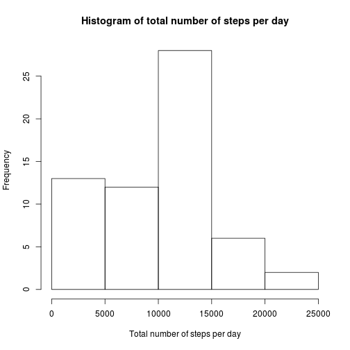
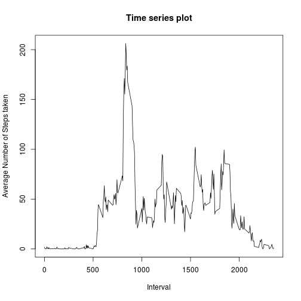

# Peer Assignment 1


### 1. What is mean total number of steps taken per day?    

* ##### Histogram of the total number of steps per day


```r
data <- read.csv("activity.csv")
dataBackUp <- data

k <- split(data,data$date)
df <- data.frame(x = character(), y = numeric(),stringsAsFactors = FALSE)

for(i in 1:length(k)){
  a <- as.character(k[[i]][1,2])
  b <- sum(k[[i]]$steps,na.rm = TRUE)
  df1 <- data.frame(a,b)
  df <- rbind(df,df1)
}

hist(df$b,xlab = "Total number of steps per day",main="Histogram of total number of steps per day")
```

 


* ##### Mean and Median of the steps taken per day


```r
mean(df$b)
```

```
## [1] 9354.23
```

```r
median(df$b)
```

```
## [1] 10395
```

  

### 2. What is the average daily activity pattern?

* ##### Make a time series plot (i.e. type = "l") of the 5-minute interval (x-axis) and the average number of steps taken, averaged across all days (y-axis)


```r
m <- split(data,data$interval)

df3 <- data.frame(x = numeric(), y = numeric())

for(i in 1:length(m)){
  a <- as.numeric_version(m[[i]]$interval[1])
  b <- mean(m[[i]]$steps,na.rm = TRUE)
  df2 <-  data.frame(a,b)
  df3 <- rbind(df3,df2)
}

plot(df3$a,df3$b,type = "l",main="Time series plot",xlab="Interval",ylab="Average Number of Steps taken")
```

 

* ##### Which 5-minute interval, on average across all the days in the dataset, contains the maximum number of steps?


```r
df3[which.max(df3$b),]$a
```

```
## [1] '835'
```


### 3. Imputing missing values

* ##### Calculate and report the total number of missing values in the dataset (i.e. the total number of rows with NAs)


```r
length(which(is.na(data)))
```

```
## [1] 2304
```

  
  
* ##### Devise a strategy for filling in all of the missing values in the dataset. The strategy does not need to be sophisticated. For example, you could use the mean/median for that day, or the mean for that 5-minute interval, etc


```r
naData <- which(is.na(data))

for(i in 1:length(naData)){
  namDat <- data$interval[naData[i]]
  data$steps[naData[i]] <- mean(m[as.character(namDat)][[1]]$steps,na.rm = TRUE)
}
```

